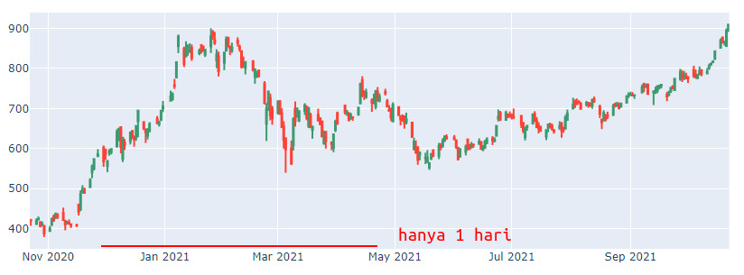
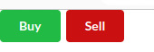
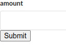

Fitur - Fitur :
1.  Login / logout Register, untuk saat ini backendnya belum ada

2. Real - Time Chart. ini akan menampilkan grafik chart realtime dalam jangka waktu 1 hari saja. data akan dikirimkan setiap jam 08.00 -  16.00 WIB. chart grafik menampilkan menampilkan data "Open", "High", "Low" "Close" jika memungkinkan data ditampilkan dalam bentuk garis batang.
   

contoh data yang dikirimkan : 
```json
        {
            "timestamp": 1675846084,   //epoch timestamp
            "open": 0.00000000,        // double
            "high": 0.00000000,       // double
            "low": 0.00000000,        // double
            "close": 0.00000000,     // double
        }
```

3. Dibawa Chart tersebut ada tombol "Buy" "Sell", ketika di klik memunculkan pop up untuk memasukkan nilang angka misal 100 dolar.

   
   contoh tombol yang ada di bawah chart :


   
   pop up yang muncul ketika tombol di klik :



   dan akan mengirimkan data seperti ini :
```json
   {
    "trading_status" : "buy",     // buy / sell
    "user" : "user1",            // username from login
    "amount" : 100.00,          // double
    "timestamp" : 1675846084   // epoch timestamp
    "emiten" : "ABDA"         // emiten ini adalah laman yang dibuka saat ini http://localhost:8000/stock/ABDA
    }
```

4.  Langanan data real-time via kafka. Ini hanya from pendaftaran hasil credential akan dikirimkan via SMTP ke email yang didaftarkan.